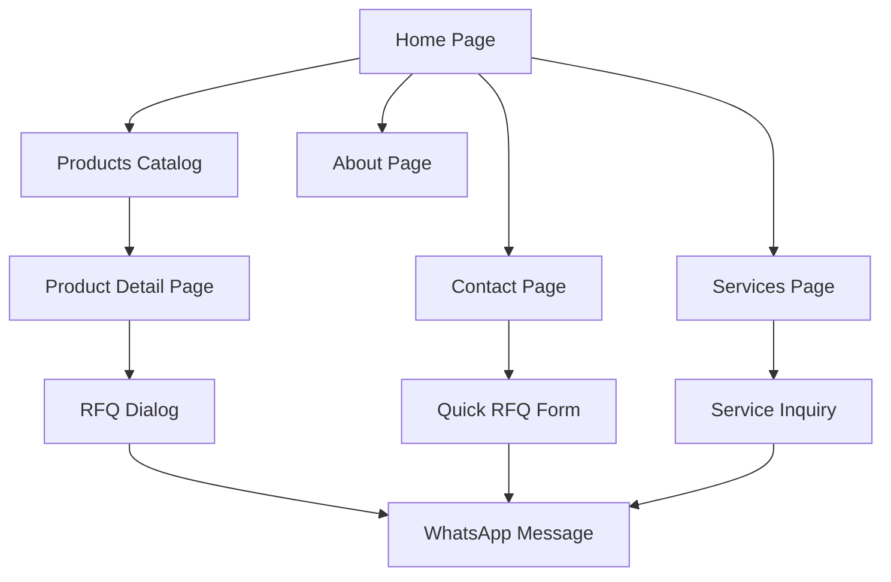

# Yui Gifts Corporate Website - Product Requirements Document

## 1. Product Overview

Yui Gifts is a professional corporate gifts website serving businesses in Miri and Kota Kinabalu, Sabah. The platform provides a comprehensive catalog of customizable corporate gifts with MOQ-based pricing and streamlined RFQ processes through WhatsApp integration.

The website addresses the need for businesses to easily browse, compare, and request quotes for corporate gifts with clear pricing tiers and professional customization services. Target market includes corporate clients, event organizers, and businesses seeking branded promotional items.

## 2. Core Features

### 2.1 User Roles

| Role | Registration Method | Core Permissions |
|------|---------------------|------------------|
| Visitor | No registration required | Browse catalog, view product details, submit RFQ |
| Business User | Optional contact form submission | Same as visitor with saved contact preferences |

### 2.2 Feature Module

Our corporate gifts website consists of the following main pages:

1. **Home page**: Hero section with brand messaging, featured categories grid, best-selling products showcase, services overview banner, and call-to-action sections.
2. **Products page**: Product catalog with advanced filtering, search functionality, category navigation, sorting options, and pagination system.
3. **Product detail page**: Product gallery, specifications table, variant selector, MOQ pricing table, imprint options, and RFQ dialog.
4. **About page**: Company story, service areas coverage, quality assurance information, and corporate social responsibility.
5. **Services page**: Imprinting methods showcase, detailed FAQ section, and service capabilities overview.
6. **Contact page**: Contact form, WhatsApp integration, location maps for both offices, business hours, and quick RFQ form.

### 2.3 Page Details

| Page Name | Module Name | Feature Description |
|-----------|-------------|---------------------|
| Home page | Hero Section | Display main headline "Corporate Gifts Made Easy in Sabah" with compelling sub-text and primary CTAs for browsing products and WhatsApp contact |
| Home page | Featured Categories | Show 10 product categories with icons in responsive grid layout linking to filtered catalog views |
| Home page | Best Sellers | Showcase top-performing products with quick view and RFQ options |
| Home page | Services Banner | Highlight key services like fast imprinting and reliable delivery with visual elements |
| Products page | Search & Filters | Server-side search by name/SKU/tags with filters for category, price range, MOQ range, imprint options, and stock status |
| Products page | Product Grid | Responsive grid (2/3/4 columns) displaying product cards with images, names, starting prices, and quick RFQ buttons |
| Products page | Sorting & Pagination | Sort by featured, price ascending/descending, newest with 24 products per page and URL persistence |
| Product Detail | Image Gallery | Primary product images with thumbnail navigation and zoom functionality |
| Product Detail | Product Information | Display specifications table, imprint options as chips, and detailed product description |
| Product Detail | Variant Selector | Dynamic variant selection based on product attributes (color, size, etc.) with real-time price updates |
| Product Detail | MOQ Pricing Table | Auto-generated pricing tiers based on quantity with highlighted active tier and unit price calculations |
| Product Detail | RFQ Dialog | Comprehensive form collecting name, company, email, phone, quantity, variant selection, and additional notes |
| About page | Company Story | Present company background, mission, and values with engaging visual content |
| About page | Service Coverage | Highlight Miri and Kota Kinabalu locations with service area maps and delivery information |
| Services page | Imprinting Methods | Grid showcase of 7 imprinting techniques with descriptions and suitable product types |
| Services page | FAQ Section | Comprehensive answers covering MOQs, lead times, file formats, color matching, proofs, delivery, and payment terms |
| Contact page | Contact Forms | Primary contact form with mailto fallback and quick RFQ mini-form for immediate inquiries |
| Contact page | Location Information | Interactive maps for both office locations with addresses, hours, and contact details |

## 3. Core Process

### Main User Flow

1. **Product Discovery**: Users land on homepage, browse featured categories or use search/filter on products page
2. **Product Selection**: Users view product details, select variants, and review MOQ pricing tiers
3. **Quote Request**: Users fill RFQ form with contact details, quantity, and specifications
4. **WhatsApp Integration**: System generates pre-filled WhatsApp message and opens user's WhatsApp client
5. **Business Communication**: Direct communication channel established between user and Yui Gifts team

## 4. User Interface Design

### 4.1 Design Style

- **Primary Color**: #CC0F2F (Corporate red for CTAs and branding)
- **Secondary Colors**: Text #111827, Background #F9FAFB, Border #E5E7EB, Surface #FFFFFF
- **Typography**: Inter font family with system fallbacks, sizes ranging from 14px to 48px
- **Button Style**: Rounded corners (8px radius) with solid primary color and hover states
- **Layout Style**: Card-based design with clean spacing, top navigation with mobile hamburger menu
- **Icons**: Lucide React icons for consistency and modern appearance

### 4.2 Page Design Overview

| Page Name | Module Name | UI Elements |
|-----------|-------------|-------------|
| Home page | Hero Section | Full-width banner with gradient overlay, large typography (48px headline), dual CTA buttons with primary/secondary styling |
| Home page | Featured Categories | 2x5 grid on mobile, 3x4 on tablet, 5x2 on desktop with category cards featuring icons and hover effects |
| Products page | Filter Sidebar | Collapsible sidebar with checkbox groups, range sliders, and clear filters button |
| Products page | Product Grid | Card layout with 4:3 aspect ratio images, product name, starting price, and ghost button for RFQ |
| Product Detail | Image Gallery | Main image area (600x600px) with thumbnail strip below, lightbox modal for full-size viewing |
| Product Detail | Pricing Table | Striped table with quantity tiers, unit prices, total calculations, and highlighted active row |
| RFQ Dialog | Form Layout | Modal dialog with form fields in 2-column layout, validation states, and prominent submit button |
| Contact page | Location Maps | Embedded Google Maps with custom markers and info windows for both office locations |

### 4.3 Responsiveness

The website follows a mobile-first approach with responsive breakpoints at 640px (sm), 768px (md), 1024px (lg), and 1280px (xl). Touch interactions are optimized for mobile devices with appropriate button sizes (minimum 44px) and gesture support for image galleries. The design adapts seamlessly across devices while maintaining functionality and visual hierarchy.