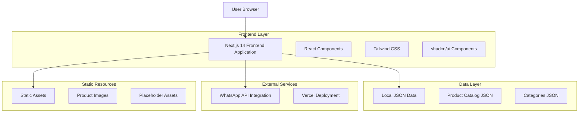
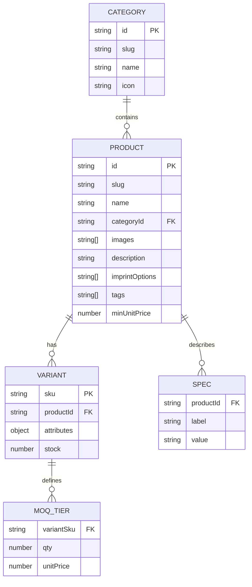

# Yui Gifts Corporate Website - Technical Architecture Document

## 1. Architecture Design



## 2. Technology Description

- **Frontend**: Next.js@14 (App Router) + TypeScript + React@18
- **Styling**: Tailwind CSS@3 + shadcn/ui components
- **Icons**: Lucide React
- **Utilities**: zod (validation) + clsx (conditional classes) + next-sitemap
- **Data**: Local JSON files (Supabase-ready architecture)
- **Deployment**: Vercel
- **Build Tool**: Built-in Next.js with Turbopack

## 3. Route Definitions

| Route | Purpose |
|-------|---------|
| / | Home page with hero section, featured categories, and best sellers |
| /about | Company information, service areas, and quality assurance |
| /products | Product catalog with search, filters, and pagination |
| /products/[slug] | Individual product detail pages with variants and pricing |
| /services | Imprinting methods showcase and comprehensive FAQ |
| /contact | Contact forms, location maps, and quick RFQ functionality |

## 4. API Definitions

### 4.1 Core API

**WhatsApp Integration**
```typescript
// WhatsApp URL Builder
function buildWhatsAppUrl(payload: RFQPayload): string
```

Request Payload:
| Param Name | Param Type | isRequired | Description |
|------------|------------|------------|-------------|
| name | string | true | Customer name |
| company | string | true | Company name |
| email | string | true | Contact email |
| phone | string | false | Phone number |
| productId | string | true | Product identifier |
| productName | string | true | Product name |
| variant | string | true | Selected variant details |
| quantity | number | true | Requested quantity |
| notes | string | false | Additional requirements |
| currentUrl | string | true | Source page URL |

Response:
| Param Name | Param Type | Description |
|------------|------------|-------------|
| whatsappUrl | string | Formatted WhatsApp deep link |

Example Usage:
```typescript
const rfqData = {
  name: "John Doe",
  company: "ABC Corp",
  email: "john@abc.com",
  phone: "+60123456789",
  productId: "YG-MUG-001",
  productName: "Classic Ceramic Mug 350ml",
  variant: "Black Color",
  quantity: 100,
  notes: "Need logo in red color",
  currentUrl: "https://yuigifts.com/products/classic-ceramic-mug-350ml"
};
```

## 5. Data Model

### 5.1 Data Model Definition



### 5.2 Data Definition Language

**TypeScript Type Definitions**

```typescript
// Core Types
interface Category {
  id: string;
  slug: string;
  name: string;
  icon: string;
}

interface Product {
  id: string;
  slug: string;
  name: string;
  categoryId: string;
  images: string[];
  description: string;
  specs: ProductSpec[];
  imprintOptions: string[];
  variants: ProductVariant[];
  tags: string[];
  minUnitPrice: number;
}

interface ProductSpec {
  label: string;
  value: string;
}

interface ProductVariant {
  sku: string;
  attributes: Record<string, string>;
  moqs: MOQTier[];
  stock?: number;
}

interface MOQTier {
  qty: number;
  unitPrice: number;
}

interface RFQPayload {
  name: string;
  company: string;
  email: string;
  phone?: string;
  productId: string;
  productName: string;
  variant: string;
  quantity: number;
  notes?: string;
  currentUrl: string;
}

// Filter and Search Types
interface ProductFilters {
  categories?: string[];
  priceRange?: [number, number];
  moqRange?: [number, number];
  imprintOptions?: string[];
  inStock?: boolean;
  search?: string;
}

interface ProductSortOption {
  field: 'featured' | 'price' | 'newest';
  direction: 'asc' | 'desc';
}

interface PaginationParams {
  page: number;
  limit: number;
}
```

**Sample Data Structure**

```json
// categories.json
[
  {
    "id": "mugs",
    "slug": "mugs",
    "name": "Mugs & Drinkware",
    "icon": "coffee"
  },
  {
    "id": "tech",
    "slug": "tech-accessories",
    "name": "Tech Accessories",
    "icon": "smartphone"
  }
]

// products.json
[
  {
    "id": "YG-MUG-001",
    "slug": "classic-ceramic-mug-350ml",
    "name": "Classic Ceramic Mug 350ml",
    "categoryId": "mugs",
    "images": [
      "/placeholder/mugs/mug-001-1.jpg",
      "/placeholder/mugs/mug-001-2.jpg"
    ],
    "description": "Durable ceramic mug perfect for corporate branding. Suitable for silkscreen and UV printing with excellent color retention.",
    "specs": [
      { "label": "Capacity", "value": "350ml" },
      { "label": "Material", "value": "Ceramic" },
      { "label": "Dimensions", "value": "9cm H x 8cm W" }
    ],
    "imprintOptions": ["Silkscreen", "UV Print", "Laser Engraving"],
    "variants": [
      {
        "sku": "YG-MUG-001-BLK",
        "attributes": { "Color": "Black" },
        "moqs": [
          { "qty": 50, "unitPrice": 9.90 },
          { "qty": 100, "unitPrice": 8.90 },
          { "qty": 250, "unitPrice": 7.90 },
          { "qty": 500, "unitPrice": 6.90 }
        ],
        "stock": 1000
      },
      {
        "sku": "YG-MUG-001-WHT",
        "attributes": { "Color": "White" },
        "moqs": [
          { "qty": 50, "unitPrice": 9.50 },
          { "qty": 100, "unitPrice": 8.50 },
          { "qty": 250, "unitPrice": 7.50 },
          { "qty": 500, "unitPrice": 6.50 }
        ],
        "stock": 1500
      }
    ],
    "tags": ["mug", "drinkware", "ceramic", "office"],
    "minUnitPrice": 6.50
  }
]
```

**Environment Configuration**

```bash
# .env.local
NEXT_PUBLIC_WHATSAPP_NUMBER=60123456789
NEXT_PUBLIC_SITE_URL=https://yuigifts.com
NEXT_PUBLIC_GA_ID=G-XXXXXXXXXX
NEXT_PUBLIC_META_PIXEL_ID=XXXXXXXXXX
```

**File Structure**

```
project-root/
├── app/
│   ├── layout.tsx
│   ├── page.tsx
│   ├── about/page.tsx
│   ├── services/page.tsx
│   ├── contact/page.tsx
│   └── products/
│       ├── page.tsx
│       └── [slug]/page.tsx
├── components/
│   ├── header.tsx
│   ├── footer.tsx
│   ├── mobile-nav.tsx
│   ├── product-card.tsx
│   ├── product-grid.tsx
│   ├── product-filters.tsx
│   ├── price-table.tsx
│   ├── rfq-dialog.tsx
│   ├── breadcrumbs.tsx
│   └── pagination.tsx
├── lib/
│   ├── data/
│   │   └── products.ts
│   ├── types.ts
│   ├── seo.ts
│   ├── format.ts
│   └── whatsapp.ts
├── public/
│   ├── placeholder/
│   │   ├── mugs/
│   │   ├── bottles/
│   │   └── [other-categories]/
│   └── favicon.ico
├── data/
│   ├── categories.json
│   └── products.json
└── content/
    ├── about.md
    ├── services.md
    └── faq.md
```